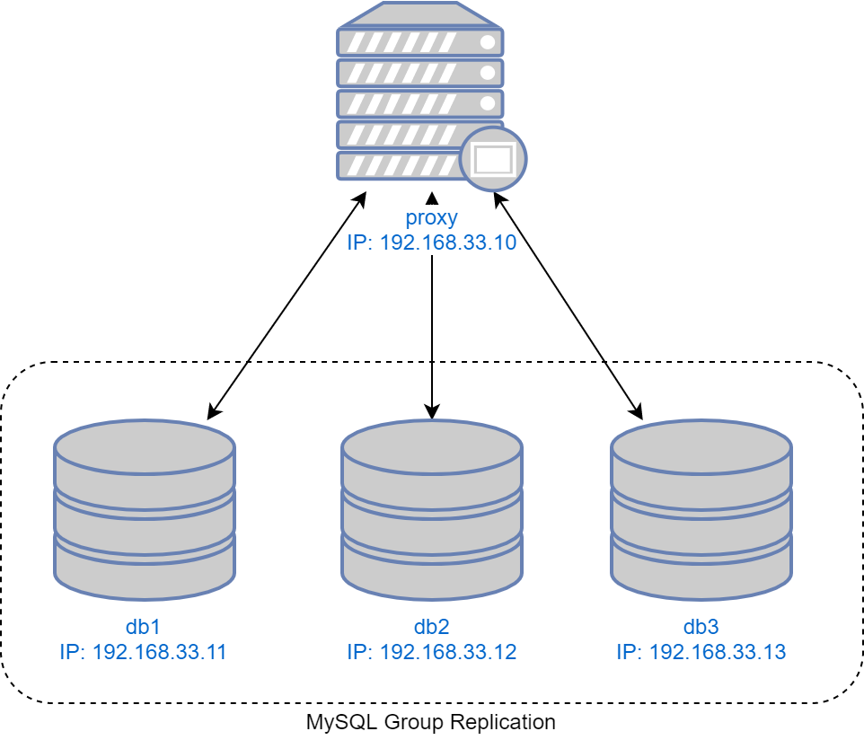
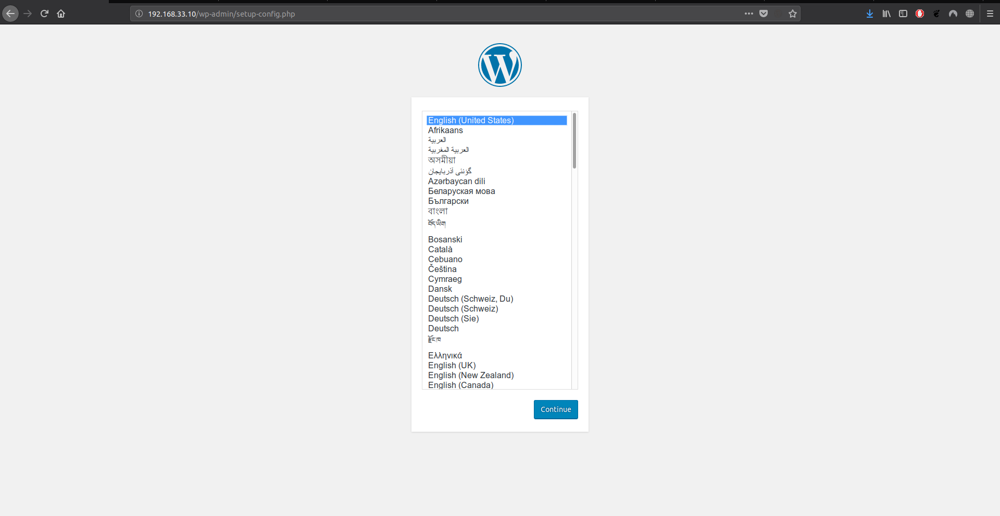
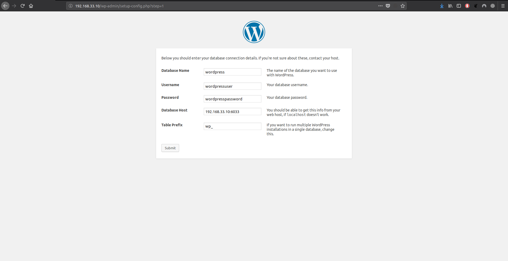
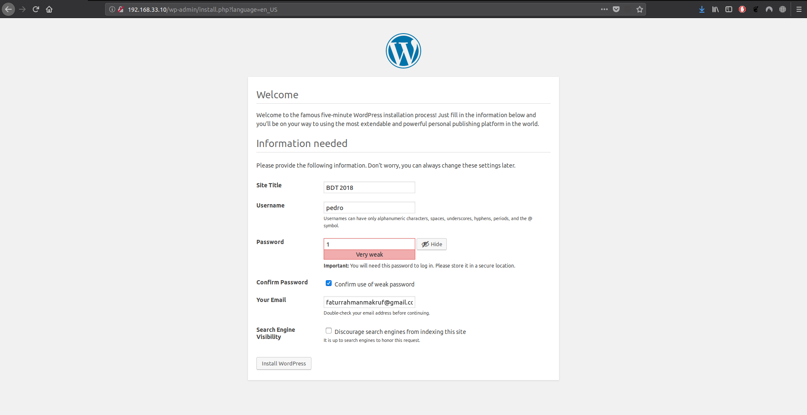
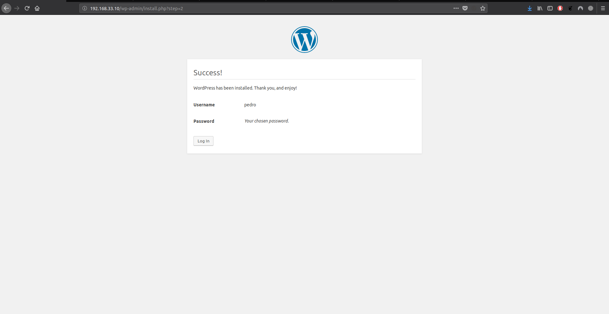
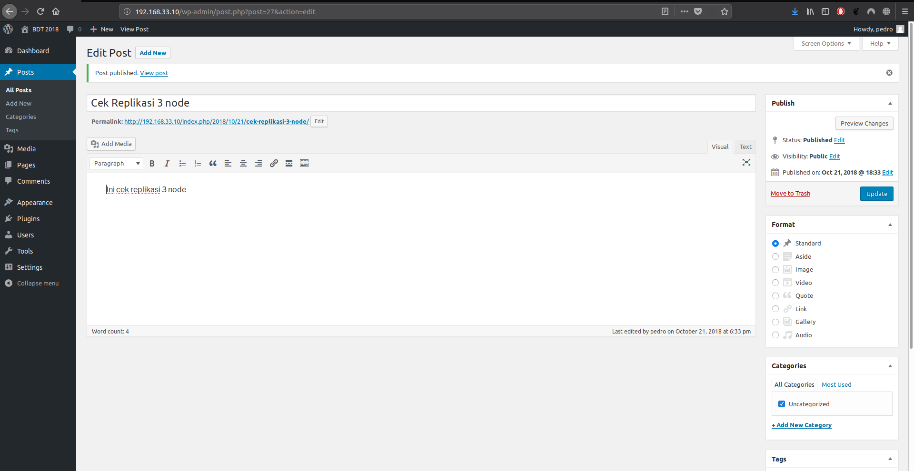
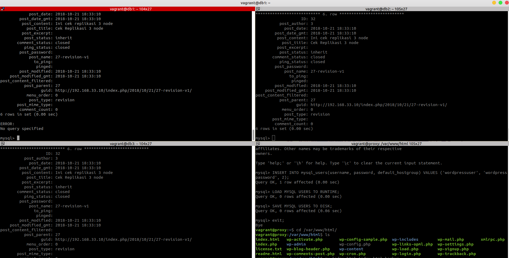
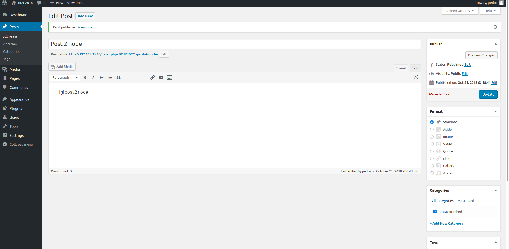
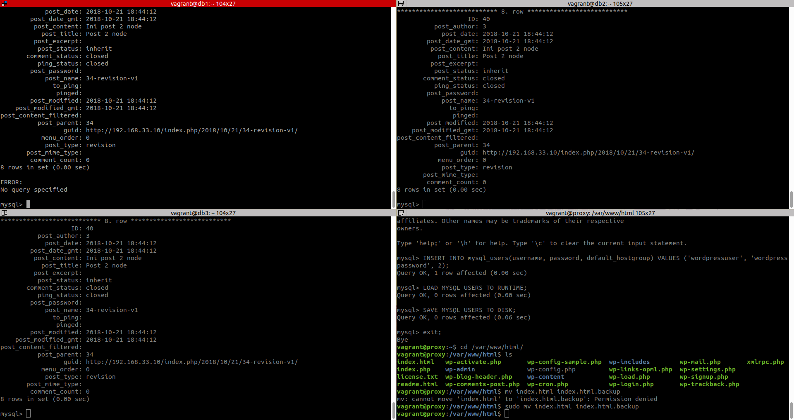

# **MySQL Group Replication**
UTS Basis Data Terdistribusi 2018

# **Outline**
- [Tujuan](#tujuan)
- [Deskripsi Sistem](#deskripsi-sistem)
- [Implementasi Sistem](#implementasi-sistem)
- [Testing](#testing)
  
# **Tujuan**
- Membuat server basis data terdistribusi dengan menggunakan konsep group replication
- Mampu menambahkan load balancer (ProxySQL) untuk membagi request ke - server basis data
- Menambahkan aplikasi CMS (Wordpress) yang memanfaatkan arsitektur tersebut
- Menguji kehandalan sistem (testing) dengan menyimulasikan matinya beberapa node dan menunjukkan bahwa data tetap tereplikasi pada node-node server basis data.
  
# **Deskripsi Sistem**

## Arsitektur Sistem


Sistem ini dibuat dengan virtual box dengan bantuan vagrant. Sistem ini terdiri dari 1 ProxySQL dan 3 MySQL Replication(MySQL Group Replication).

## ProxySQL
ProxySQL bertugas sebagai load balancer dengan konfigurasi sebagai berikut :
- Sistem Operasi Ubuntu 16.04
- MySQL Community Edition
- 512 MB RAM
- IP 192.168.33.10

## MySQL Group Replication
MySQL Group Replication terdiri dari 3 server, yaitu **db1**, **db2**, **db3** dengan setiap server mempunyai konfigurasi sebagai berikut :
- Sistem Operasi: Ubuntu 16.04
- MySQL Server Community Edition
- 512 MB RAM
- IP 192.168.33.11, 192.168.33.12, 192.168.33.13

# **Implemenstasi Sistem**
Implementasi sistem ini berdasarkan file-file yang sudah diberikan oleh dosen dengan nama file **mysql-cluster-proxysql.zip**.

### 1. Ekstrak File
Mengekstrak file ekstensi zip yang diberikan dosen lalu masuk ke dalam direktori hasil ekstraksi.
```bash
$ cd mysql-cluster-proxysql/
```

### 2. Modifikasi Vagrantfile
Ubah isi vagrantfile menjadi seperti berikut :
```ruby
# -*- mode: ruby -*-
# vi: set ft=ruby :

# All Vagrant configuration is done below. The "2" in Vagrant.configure
# configures the configuration version (we support older styles for
# backwards compatibility). Please don't change it unless you know what
# you're doing.

Vagrant.configure("2") do |config|

  # MySQL Cluster dengan 3 node
  (1..3).each do |i|
    config.vm.define "db#{i}" do |node|
      node.vm.hostname = "db#{i}"
      node.vm.box = "bento/ubuntu-16.04"
      node.vm.network "private_network", ip: "192.168.33.1#{i}"

      # Opsional. Edit sesuai dengan nama network adapter di komputer
      node.vm.network "public_network", bridge: "wlo1"

      node.vm.provider "virtualbox" do |vb|
        vb.name = "db#{i}"
        vb.gui = false
        vb.memory = "512"
      end

      node.vm.provision "shell", path: "deployMySQL1#{i}.sh", privileged: false
    end
  end

  config.vm.define "proxy" do |proxy|
    proxy.vm.hostname = "proxy"
    proxy.vm.box = "bento/ubuntu-16.04"
    proxy.vm.network "private_network", ip: "192.168.33.10"
    proxy.vm.network "public_network",  bridge: "wlo1"

    proxy.vm.provider "virtualbox" do |vb|
      vb.name = "proxy"
      vb.gui = false
      vb.memory = "512"
    end

    proxy.vm.provision "shell", path: "deployProxySQL.sh", privileged: false
  end
end
```

### 3. Melakukan Vagrant Up
Jalankan sampai semua vm terbentuk dengan perintah 
```bash
$ vagrant up 
```
Kemudian lakukan provision untuk proxy dengan perintah
```bash
$ vagrant ssh proxy
```
Dan jalanakn
```bash
vagrant@proxy:~$ mysql -u admin -p -h 127.0.0.1 -P 6032 < /vagrant/proxysql.sql
#password: admin
```
Tujuan provision diatas adalah :
- Mengganti password admin ProxySQL
- Menambahkan user monitoring
- Menambahkan node server MySQL
- Menambahkan user `playgrounduser` sebagai user MySQL biasa yang memiliki database `playground`
  
Tes koneksi dari salah satu node MySQL Group Replication ke ProxySQL
```bash
vagrant@db2:~$ mysql -u playgrounduser -p -h 192.168.33.10 -P 6033
#password: playgroundpassword
```

### 4. Instalasi Apache, PHP, dan Wordpress
Melakukan instalasi dengan menjalankan
```bash
vagrant@proxy:~$ sudo apt-get install -y apache2 php libapache2-mod-php php-mcrypt php-mysql
```

### 5. Konfigurasi Wordpress
Membuat database yang akan digunakan untuk wordpress di MySQL Group Replication dengan membuat databases di salah satu node.
```bash
vagrant@db1:~$ mysql -u root -p
#password: admin
```
```sql
mysql> CREATE DATABASE wordpress;
mysql> CREATE USER 'wordpressuser'@'%' IDENTIFIED BY 'wordpresspassword';
mysql> GRANT ALL PRIVILEGES ON wordpress.* TO 'wordpressuser'@'%';
mysql> FLUSH PRIVILEGES;
```
Tambahkan user dan password yang sama pada ProxySQL
```bash
vagrant@proxy:~$ mysql -u admin -p -h 127.0.0.1 -P 6032
#password: password
```
```sql
mysql> INSERT INTO mysql_users(username, password, default_hostgroup) VALUES ('wordpressuser', 'wordpresspassword', 2);
mysql> LOAD MYSQL USERS TO RUNTIME;
mysql> SAVE MYSQL USERS TO DISK;
```
Installasi Wordpress

Melakukan installasi dengan mengakses ([http://192.168.33.10](http://192.168.33.10))









Cek Replikasi
Melakukan post pada di ([http://192.168.33.10/wp-admin](http://192.168.33.10/wp-admin))



Cek di semua node MySQL Replication apakah ada recordnya



# Testing
## Mematikan salah satu MySQL
```bash
vagrant@db1:~$ sudo service mysql stop
```
## Buat post baru di wordpress



## Hidupkan lagi MySQL yang telah dimatikan dan cek isi database
```bash
vagrant@db1:~$ mysql -u root -p
```
```sql
mysql> use wordpress;
mysql> select * from wp_posts\G;
```



Testing berhasil dan proses replikasi si setiap node berjalan ketika ada node yang baru dihidupkan.