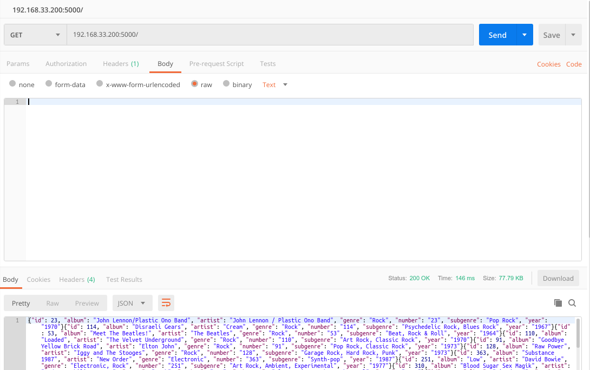
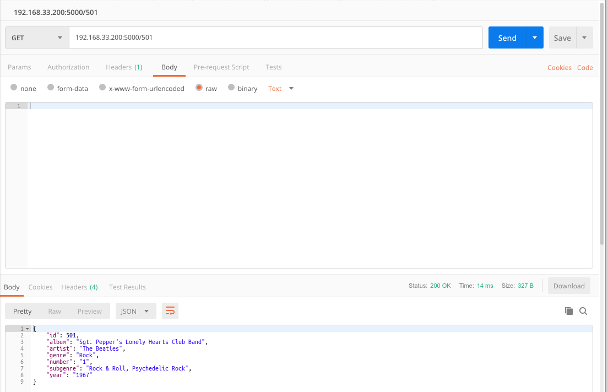
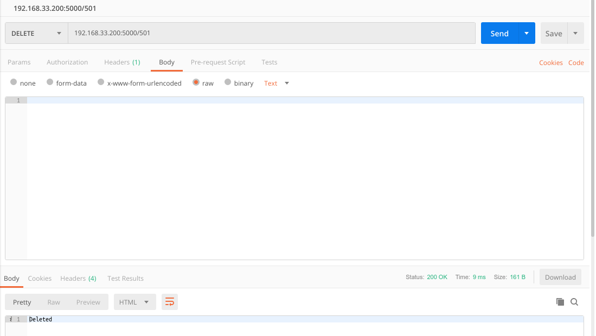

# **Tugas Cassandra**

## **Index**
- [Requirements](#Requirements)
- [Dataset](#Dataset)
- [Installation](#Installation)
  
## **Requirements**
- Cassandra
- Python 2.7
- Flask
- Virutalenv
- Cassandra Driver
- Vagrant

## **Dataset**
Dataset yang digunakan adalah [Rolling Stones's 500 Greatest Albums of All Time](https://www.kaggle.com/notgibs/500-greatest-albums-of-all-time-rolling-stone)

Dataset diedit agar mempunyai primary key

## **Installation**
1. Vagrant Up Vagrantfile
   ```sh
   $ vagrant up
   ```
2. Masuk ke VB
   ```sh
   $ vagrant ssh
   ```
3. Masuk ke directory vagrant
   ```sh
   $ cd /vagrant
   ```
4. Create Virtual Environment
   ```sh
   vagrant@cassandra: virtualenv venv
   ```
5. Activate Virtual Environment
   ```sh
   vagrant@cassandra: . venv/bin/activate
   ```
6. Install Requirements
   ```sh
   (venv) vagrant@cassandra: pip install -r requirements.txt
   ```
7. Masuk ke Cassandra Shell
   ```sh
   (venv) vagrant@cassandra: cqls
   ```
8.  Membuat Keyspace
   ```SQL
   CREATE KEYSPACE rsmagz
   WITH replication = {
       'class' : 'SimpleStrategy',
       'replication_factor' : 1
       };
   ```
11. Membuat Table
   ```SQL
   CREATE TABLE rsmagz.album_list(id int,number text, year text, album text, artist text, genre text, subgenre text, PRIMARY KEY(id));
   ```
11. Import Data albumlist.csv
   ```SQL
   COPY rsmagz.album_list(number,year,album,artist,genre,subgenre,id) FROM 'albumlist.csv' WITH HEADER = TRUE;
   ```
12. Run flask
    ```sh
    (venv) vagrant@cassandra: export FLASK_ENV=development
    (venv) vagrant@cassandra: flask run --host=0.0.0.0
    ```

## **API**
1. Create
   ```sh
   192.168.33.200:5000/
   #methods POST
   ```
   
2. Read All
   ```sh
   192.168.33.200:5000/
   #methods GET
   ```
   
3. Search by ID
   ```sh
   192.168.33.200:5000/<id>
   #methods GET
   ```
   
4. Update
   ```sh
   192.168.33.200:5000/<id>
   #methods PUT
   ```
   
   Cek Update
   
5. Delete
   ```sh
   192.168.33.200:5000/<id>
   #methods DELETE
   ```
   
   Cek Delete
   
